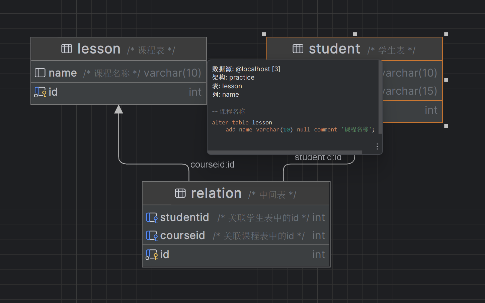
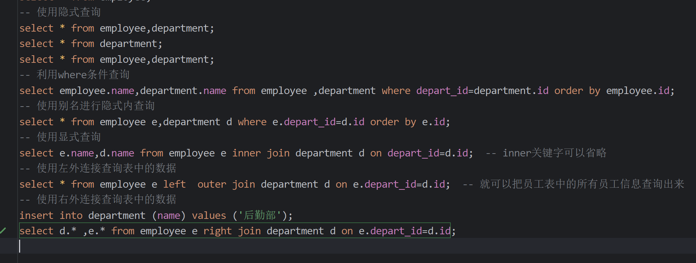
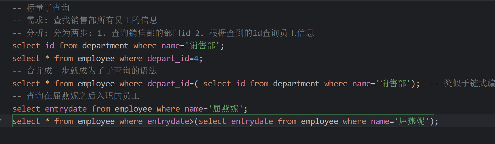
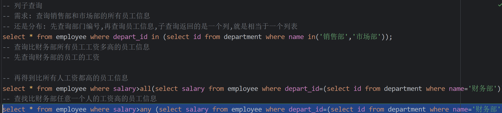
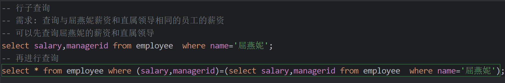
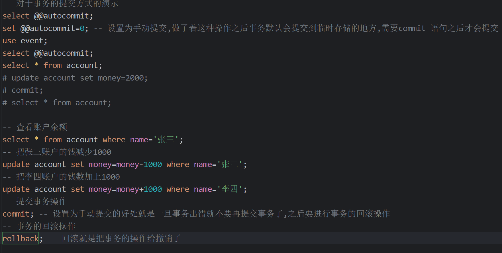
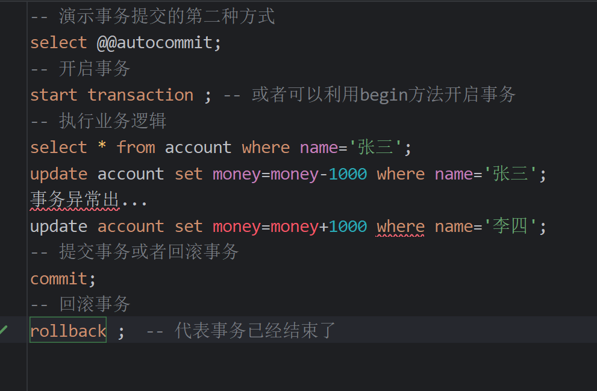

# SQL语言  
## SQL通用语法和分类  
SQL通用语法:
1. SQL语句可以单行或者多行书写,以分号结尾  
2. SQL语句可以使用空格/缩进来增强语句的可读性  
3. MySQL数据库的SQL语句不区分大小写,关键字建议大写  
4. 注释: 
   1. 单行注释: --注释内容 或 # 注释内容 (MySQL特有)  
   2. 多行注释: /* 注释内容*/ 
### SQL语句的分类  
分类|说明  
---|---
DDL|数据定义语言,用来定义数据库对象(数据库,表,字段)  
DML|数据库操纵语言,用来对数据库表中的数据进行增删改  
DQL|数据查询语句,用来查询数据库中表的记录  
DCL|数据控制语言,用来创建数据库用户,控制数据库的访问权限   
## SQL-DDL数据库操纵 
数据库操纵:  
1. 查询: 
   1. 查询所有数据库 SHOW DATABASES;
   2. 查询当前数据库 SELECT DATABASE();  
2. 创建: 
   1. CREATE DATABASE [IF NOT EXISTS] 数据库名 [DEFAULT CHARSET 字符集] [COLLECT 排序规则]  
3. 删除  
   1. DROP DATABASE [IF EXISTS]数据库名  
4. 使用 
   1. USE 数据库名
### 对数据库中表的查询  
1. 查询当前数据库中的所有表:
   1. SHOW TABLES;
2. 查询表的结构:
   1. DESC 表名;
3. 查询指定表的建表语句;
   1. SHOW CREATE TABLE 表名;
4. DDL-表操作-创建：  
```DDL
CREATE TABLE 表名(
字段1 字段1类型[COMMENT 字段1注释],
字段2 字段2类型[COMMENT 字段2注释],
字段3 字段3类型[COMMENT 字段3注释],
...
字段n 字段n类型[COMMENT 字段n注释]

)[COMMENT 表注解];
```
#### DDL-表操作数据类型 
1. MySQL中的数据类型很多,主要分为三类: 数值类型,字符串类型,日期时间类型.   
2. 数值类型：  

类型名|描述  
---|---
TINYINT |小整数值  
SMALLINT|大整数值  
MEDIUMINT|大整数值  
INT或者INTEGER|大整数值  
BIGINT|极大整数值  
FLOAT|单精度浮点数值  
DOUBLE|双精度浮点数值  
DECIMAL|小数值(精确定点数)  
1. 注意:数据类型之后加上UNSIGNED表示无符号类型(用于表示非负的数据)  
#### 字符串类型  
类型|描述  
---|---
CHAR|定长字符串  
VARCHAR|变长字符串  
TINYBLOB|不超过255个字符的二进制数据  
TINYTEXT|短文本字符串  
BLOB|二进制形式的长文本字符串  
TEXT|长文本数据  
MEDIUMBLOB|二进制 形式的中等长度文本数据  
MEDIUMTEXT|中等长度的文本数据  
LONGBLON|二进制形式的极大文本数据  
LONGTEXT|极大文本数据
1. 注意类型的后面就是应该占用的空间char(3),varchar(50),char的性能高,varchar的性能较差,长度不定用varchar,长度确定用varchar 
#### 日期类型  
类型|格式|描述  
---|---|---
DATE|YYYY-MM-DD|日期值  
TIME|HH:MM:SS|时间值或者持续时间  
YEAR|YYYY|年份值  
DATATIME|YYYY-MM-DD HH:MM:SS|混合日期和时间值  
TIMESTAMP|YYYY-MM-DD HH:MM:SS|混合时间和日期,时间戳  
1. 比如 birthday date  
#### DDL-表操纵-修改  
1. 添加字段  
   1. ALTER TABLE 表名 ADD 字段名 类型(长度)[COMMENT 注释] [约束];
2. 修改数据类型  
   1. ALTER TABLE 表名 MODIFY 字段名 新数据类型(长度);  
3. 修改字段名和字段类型 
   1. ALTER TABLE 表名 CHANGE 旧字段名 新字段名 类型(长度) [COMMETN 注释][约束];   
4. 删除字段  
   1. ALTER TABLE 表名 DROP 字段名;  
5. 修改表名
   1. ALTER TABLE 表名 RENAEM TO 新表名;
6. 删除表: 
   1. DROP TABLE [IF EXISTS] 表名;(删除表)
   2. TRUNCATE TABLE 表名;(删除指定表并重新创建该表)(格式化所有数据)  
#### 利用图形化界面(DataGrip)
1. 可以直接利用图形化界面创建数据库 
## DML语句  
1. 数据操作语言,对数据库中表的数据记录 进行增删改
2. 增加数据(INSERT),修改数据(UPDATE),删除数据(DELETE)
### 添加数据  
1. 给指定字段添加数据  
INSERT INTO 表名(字段名1,字段名2,...) VALUES(值1,值2);  
2. 给全部的字段添加数据  
INSERT INTO 表名 VALUES(值1,值2); -- 值1和值2分别对应表中不同字段的值  
3. 批量添加数据  
 INSERT INTO 表名(字段名1,字段名2) VALUES (值1,值2...),(值1,值2...),(值1,值2...);    
  INSERT INTO 表名 VALUES(值1,值2...),(值1,值2...),(值1,值2);
4. 注意点:
   1. 插入数据时,指定的字段顺序需要与值的顺序一一对应  
   2. 字符串与日期型数据应该包含在引号中  
   3. 插入的数据大小,应该在字段的规定范围内  
### 修改数据  
1. 修改数据: 
UPDATE 表名 SET 字段名1=值1,字段名2=值2,...[WHERE 条件];
2. 注意点: 修改语句的条件可以有,可以没有,如果没有条件,则会修改整张表的所有数据
3. 注意条件的书写(笔记中[]语义上表示(),可以有也可以没有,如果其中的数据出现,不需要带上中括号) 比如update user name='zhangsan' where id=1;
### 删除数据  
1. DML-删除数据  
DELETE FROM 表名 [WHERE 条件];
2. 注意:
   1. DELETE语句的条件可以有可以没有,如果没有条件,则会删除整张表的所有数据
   2. DELETE语句不可以删除某一个字段的值(可以使用UPDATE方法删除,把字段的值设为null)  
## DQL语句  
1. 用于查询数据库中的表的记录(关键字: SELECT)  
2. DQL语句中的语法结构  
```dotnetcli
SELECT 字段列表 
FROM 表名列表
WHERE 条件列表  
GROUP BY 分组字段列表
HAVING 分组后条件列表
ORDER BY 排序字段列表
LIMIT 分页参数
```
### 基础查询  
1. 查询多个字段:
   1. SELECT 字段名1,字段名2,字段名3... FROM 表名;  
   2. SELECT * FROM 表名  
2. 设置别名  
   1. SELECT 字段名1[AS 别名1],字段名2[AS 别名2]...FROM表名;
3. 去除重复记录  
   1. SELECT DISTINCT 字段列表 FROM 表名;  
### 条件查询  
1. 条件查询的语法:
   1. SELECT 字段列表 FROM 表名 WHERE 条件列表;
2. 条件的种类  

比较运算符|功能  
---|---
 ( > )   |  大于  
   <      | 小于  
   (>=)  | 大于等于  
   (<=)|小于等于   
   =|等于  
   <>或者!=|不等于  
   BETWEEN...AND...|在某个范围之内(含最大值,最小值)  
   IN(...)|在in之后的列表中的值,多选一  
   LIKE 占位符|模糊匹配(_匹配单个字符,%匹配多个字符)  
   ISNULL(字段名)|时NULL 

逻辑运算符|功能  
---|---
AND或者&&|并且(多个条件同时成立)  
OR或者(你懂的) | 或者(多个条件任意一个成立)  
NOT 或 ！| 非,不是  
### 聚合函数  
1. 作用: 将一列数据作为一个整体,进行纵向计算  
2. 常见聚合函数  

函数|功能  
---|---
count|统计数量  
max|最大值  
min|最小值  
avg|平均值  
sum|求和    
3. 语法
    1. SELECT 聚合函数(字段列表)FROM 表名[WHERE 条件];  
### 分组查询  
1. 语法: 
    1. SELECT 字段列表 FROM 表名 [WHERE 条件] GROUP BY 分组字段名 [HAVING 分组后过滤条件]
2. where和having的区别  
   1. 执行时机不同:where是分组之前进行过滤,不满足where条件,不参与分组,而having是分组之后对结果进行过滤的  
   2. 判断条件不同:where不能对聚合函数进行判断,而having可以  
3. 代码实现  
```sql
-- 根据性别分组
select  gender,count(*) from employee group by gender; -- 首先考虑分组,group by之后的字段就是分组需要的字段,前面就是分组字段之下的对应值
-- 以上语句表名coutn(*)是对应值 ,group by之后是分段依据,select后面是新字段
select gender,avg(age) from employee group by  gender;
select workaddress ,count(*) as people from employee where age<45 group by workaddress having people >=3;
-- count(*)的含义就是对于后面的分组的依据字段统计个个符合字段中元素的数量,比如以上就是统计按照员工地址划分
```
4. 细节:
   1. 执行顺序: where> 聚合函数 > having  
   2. 分组之后,查询的字段一般为聚合函数和分组字段,查询其他字段无任何意义(having对于每个分组得到的数据都会判断是否符合having的条件)(查询其他的字段只会得到第一个查到的值)  
### 排序查询  
1. 语法:
   1. SELECT 字段列表 FROM 表名 OREDR BY 字段1 排序方式1,字段2 排序方式2;(进行多字段排序)
2. 排序方式:
   1. ASC:升序(默认)
   2. DESC:降序
3. 注意:
   1. 如果是多字段排序,当第一个字段相同时,才会根据第二个字段排序
4. 代码实现  
```sql
select * from employee order by age asc;
select * from employee order by  entrydate desc;
select * from employee order by age ,entrydate desc;
```
### 分页查询  
1. 语法  
   1. SELECT 字段列表 FROM 表名 LIMIT 起始索引,查询记录数;
2. 注意:
   1. 起始索引从0开始,起始索引=(查询页码-1)*每页显示记录数  
   2. 分页查询是数据库的方言,不同数据库实现不同,mysql中是LIMIT  
   3. 如果查询的是第一页数据,起始索引可以省略,直接简写为limit 10;(与数组相同)  
```sql
select * from employee limit 10;
select * from employee limit 10 ,10;
```
3. 实例  
```sql
select * from employee where age between 20 and 23;
select * from employee where age between 20 and 40 && name like '___' && gender='男'; -- ___就是匹配字符的符号
select gender ,count(*) from employee where age<60 group by  gender;  -- 注意逗号分割
select name,age,entrydate from employee where age<=35 order by age ,entrydate desc;
select * from employee where gender='男' && age between 20 and 40 order by age,entrydate limit 5;
```
### DQL语句的执行顺序  
1. 上面的是编写顺序  
2. DQL语句的执行顺序 1. from 2. where 3. group by 4. having 5. select 6. order by 7. limit  
## DCL语言  
1. 用于管理数据库用户,控制数据库的访问权限
2. 管理用户的语法:
   1. 查询用户  
      1. USE mysql;(访问系统数据库mysql,查询表结构user得到用户)
      2. SELECT * FROM user;
   2. 创建用户  
      1. CREATE USER '用户名'@'主机名' IDENTIFIED BY '密码';
   3. 修改用户密码:
      1. ALTER USER '用户名'@'主机名' IDENTIFIED WITH mysql_native_password BY '新密码';
   4. 删除用户:
      1. DROP USER '用户名'@'主机名';
3. 注意事项 
   1. 主机名可以利用% 匹配
   2. 这类SQL语句开发人员利用的少,主要是DBA(数据库管理人员)使用
#### 权限控制  
1. 权限的种类  

权限|说明   
---|---
ALL,ALL PRIVILEGES| 所有权限  
SELECT|查询数据  
INSERT|插入数据  
UPDATE|修改数据  
DELETE|删除数据  
ALTER|修改表  
DROP|删除表/数据库/视图  
CREATE|创建数据库/表
2. 权限控制语句的语法  
   1. 查询权限:
      1. SHOW GRANTS FOR '用户名'@'主机名';
   2. 授予权限  
      1. GRANTS 权限列表 ON 数据库名.表名(可以使用通配符) TO '用户名'@'主机名';
   3. 撤销权限  
      1. REVOKE 权限列表 ON 数据库名.表名 FROM '用户名'@'主机名';
## 函数  
1. 函数是指一段可以直接被另一端程序调用的程序或者代码
2. 常用的字符串函数:

函数|功能  
---|---
CONCAT(S1,S2..Sn)|字符串拼接,将s1,s2...sn拼接成一个字符串  
LOWER(str)|把字符串str全部转为小写  
UPPER(str)|把字符串str全部转为大写  
LPAD(str,n,pad)|左填充,用字符串pad对str的左边进行填充,达到n个字符串长度  
RPAD(str,n,pad)|右填充,用字符串pad对str的右边进行填充,达到n个字符串长度  
TRIM(str)|去掉字符串头部和尾部的空格  
SUBSTRING(str,start,len)|返回字符串str从start位置起的len个长度的字符串  
### 数值函数  
1. 常见的数值函数:  

函数|功能  
---|---
CEIL(X)|向上取整  
FLOOR(X)|向下取整  
MOD(x,y)|返回x/y的模  
RAND()|返回0-1之间的随机数  
ROUND(x,y)|求参数x的四舍五入值,保留y位小数  

### 日期函数  
1. 常见的日期函数  

函数|功能   
---|---
CURDATE()|返回当前日期值  
CURTIME()|返回当前时间  
NOW()|返回当前日期和时间  
YEAR(date)|获取指定date的年份  
MONTH(date)|获取指定date的日期  
DAY(date)|获取指定date的日期  
DATE_ADD(date,INTERVAL expr type)|返回一个日期/时间值加上一个时间间隔expr后的时间值  
DATEDEFF(date1,date2)|返回起始时间date1和结束时间date2之间的天数  

### 流程控制函数  
1. 流程控制函数可以实现条件筛选,从而提高语句的效率  
2. 常见的流程函数  

函数|功能   
---|---
IF(value,t,f)|如果value为true,则返回t,否则返回f  
IFNULL(value1,value2)|如果value1不为空,返回value1,否则返回value2  
CASE WHEN[val1] THEN[res1] ...ELSE[default] END|如果val1为true,返回res1,... 否则返回default默认值  
CASE [expr] WHEN[val1] THEN[res1]...ELSE[default] END|如果expr的值等于val1,返回res1,... 否则返回default默认值(expr的值就是表达式)  
## 约束  
1. 概念:约束是作用于表中字段上的规则,用于限制存储在表中的数据
2. 目的: 保证数据库中的数据的正确性,有效性和完整性  
3. 分类：

约束|描述|关键字  
---|---|---
非空约束|限制字段的数据不能为null|NOT NULL  
唯一约束|保证该字段的所有数据都是唯一的,不重复的|UNIQUE  
主键约束|主键是一行数据的唯一标识(比如用于区分每一个数据的id和区分每一个人的身份证号),要求非空且唯一|PRIMARY KEY(后面加上关键字AUTO_INCREMENT使得主键自动增长)  
默认约束|保存数据时,如果没有指定该字段的值,则采用默认值|DEFAULT  
检查约束|保证字段值满足某一个规则|CHECK  
外键约束|用来让两张表之间建立联系,保证数据的一致性和完整性|FOREIGN KEY  
### 约束的使用  
```sql
create table user1(
    id int  primary key auto_increment comment '表中的主键,自动增长' ,
    name varchar(10) not null unique comment '姓名,不为空并且唯一',
    age int check(age>=0&&age<=120) comment '年龄',
    status char(1) default 1 comment '状态,默认为1',
    gender char(1) comment '性别'
) comment '用户表';
```
1. 细节: 约束的建立在评论之前,可以利用图形化界面常见约束  
### 外键约束  
1. 概念:外键用来让两张表的数据之间建立联系,从而保证数据的一致性和完整性
2. 比如一张表之中的外键就是另外一张表中的主键取值,有外键的表称为子表,被关联主键的表被称为主表
3. 语法格式：
```sql
CREATE TABLE 表名(
    字段名 数据类型, 
    ...
    [CONSTRAINT][外键名称] FOREIGN KEY(外键字段名) REFERENCES 主表 (主表列表)
);
-- 添加字段时添加外键约束 
ALTER TABLE 表名 ADD CONSTRAINT 外键名称 FOREIGN KEY(外键字段名) REFRENCES 主表(主表列名)  
```
4. 删除外键: ALTER TABLE 表名 DROP FOREIGN KEY 外键名称;
#### 外键约束中的删除和更新行为  
1. 删除/更新行为  

行为|说明  
---|---
NO ACTION|当在父表中删除或者更新对应数据时,首先检查是否有对应外键,如果有对应外键就不允许删除或者更新(于RESIRICT一致)  
RESIRICT|同上  
CASCADE(cascade)|当在父表中删除数据时,首先检查是否有对应外键,如果有,就也删除对应外键,更新就同步更新   
SET NULL|当在父表中删除对应记录时,首先检查该记录是否有对应值,如果有则设置子表中该外键的值为null(这就要求外键允许取值为null)  
SET DEFAULT|父表中有变更时,子表将外键列设置成一个默认的值(Innodb不支持)

2. 使用以上行为的语法:
ALTER TABLE 表名 ADD CONSTRAINT 外键名称 FOREIGN KEY (外键字段) REFERENCES 主表名(主表字段名) ON UPDATE CASCADE ON DELETE RESIRICT; 
## 多表查询 
### 多表关系  
1. 项目开发中,在进行数据库表结构设计时,会根据业务需求以及业务模块之间的关系,分析并设计表结构,由于业务之间相互关联,所以各个表结构之间也存在着各种联系,基本分为三种: 一对多 多对多 一对一  

2. 一对多: 比如部门于员工之间的关系,一个部门不只有一个员工,一个员工归属于一个部门,实现: 在多的一方(员工)建立外键,指向的一方的主键

3. 多对多: 比如学生与课程之间的关系,一个学生可以选择多个课程,每个课程可以有多个学生 实现方式: 建立第三张中间表,中间表中至少包含两个外键,分别关联两方主键(从而反应出两个表中数据之间的关系) 
  

4. 一对一的关系: 多用于单表拆分,将一张表的基础字段放在一张表中,其他字段放在另外一张表中,以提高操作效率  实现: 在任意一方加入外键(userid),关联另外一方的主键,并且设置外键为唯一的unique

### 多表查询  
1. 对于具有多表关系的两张表,利用原来的查询语句就可以这样写 select * from 子表,父表; 但是得到的结果会产生笛卡尔积的现象(就是在数学中,两个集合A和B集合的所有组合情况(多表查询中要消除无效的笛卡尔积)),利用where条件使得互相连接的键值相同就可以消除笛卡尔积
2. 多表查询中的连接查询:
   1. 内连接: 相当于查询A,B交集部分的数据  
   2. 外连接: 
      1. 左外连接: 相当于查询左表中的所有数据,以及两表交集部分的数据  
      2. 右外连接: 查询右表中的所有数据,以及两张表交集部分的数据  
   3. 自连接: 当前表与自身的连接查询,自连接必须使用表别名
#### 内连接
1. 查询交集部分
2. 查询语法:
   1. 隐式内连接: SELECT 字段列表 FROM 表1,表2 WHERE 条件...;
   2. 显式内连接: SELECT 字段列表 FROM 表1 [INNER] JOIN 表2 ON 连接条件...;
#### 外连接  
1. 查询语法:
   1. 左外连接: SELECT 字段列表 FROM 表1 LEFT [OUTER] JOIN 表2 ON 条件...;(注意相当于查询左表中的所有数据,包含两表中的交集数据)  
   2. 右外连接: SELECT 字段列表 FROM 表1 RIGHT [ OUTER] JOIN 表2 ON 条件...;(查询右表中的数据)
2. 代码实现：


#### 自连接
1. 自连接查询语法
SELECT 字段列表 FROM 表A 别名 表A 别名B ON 条件 ...;
2. 自连接查询可以式内连接也可以是外连接
3. 应用场景: 查询的数据都在一张表中,并且表中的某些字段有对应关系(就是一张表中的两个字段之间的关系为关联关系)
4. 查询时,把这一张表看成两张表
#### 联合查询  
1. 对于union查询，就是把多次查询的结果合并起来,形成一个新的查询结果集  
2. 语法:
```sql
SELECT 字段列表 FROM 表A ...
UNION [ALL]
SELECT 字段列表 表B ...;
```
3. 上面满足结果A,下面结果满足结果B(去掉all可以去重)
4. 注意点: 对于联合查询,多张表的列数必须保持一致,字段类型也要一致 union all 会将全部的数据直接合并在一起,union 会对和合并之后的数据去重
### 子查询  
1. 概念: SQL语句中嵌套的SELECT语句,称为嵌套查询,又称为子查询
2. 比如 SELECT * FROM t1 WHERE column1=(SELECT column1 FROM t2);
3. 子查询外部的语句可以是: INSERT/UPDATE/DELETE/SELECT中的任意一个  
4. 根据子查询的结果不同可以分为:
   1. 标量子查询:子查询的结果返回一个值  
   2. 标子查询: 子查询的结果是一列  
   3. 行子查询: 子查询的结果是一行  
   4. 表子查询: 子查询的结果为多行多列
5. 根据子查询的位置可以分为: WHERE之后的,FROM之后的,SELECT之后的
#### 标量子查询  
1. 返回的是单个值,最为简单
2. 常用的运算符: 就是各种算数运算符号
3. 引用场景: 就是要查询的数据要经过几步才可以查到的情况就可以考虑使用标量子查询
4. 代码实现:  

5. 注意子查询中的代码要包裹在小括号里面(括号中的才叫子查询)
#### 列子查询  
1. 就是指子查询的结果返回的是列  
2. 常用的操作符:IN,NOT IN,ANY,SOME,ALL  

操作符|描述  
---|---
IN|在指定的集合范围中,多选一  
NOT IN|不在指定的集合范围中  
ANY|子查询返回列表中,有任意一个满足条件即可  
SOME|与ANY等同,使用SOME的地方可以使用ANY  
ALL|子查询返回列表的所有值多必须满足

3. 引用场景

#### 行子查询  
1. 行子查询中子查询的结果子查询返回的是一行数据
2. 常用的操作符号: =,<>,IN,NOT IN;
3. 代码实现


#### 表子查询
1. 子查询返回的结果是多行多列  
2. 常用的操作符: IN
3. 就是把待查询字段组成一个列表,再在子查询得到的列表中查询(表子查询就相当于是多个行子查询的综合)
4. 应用场景: 就是多个行子查询的综合,并且子查询查到的结果包含多个字段和多行,子查询的结果可以作为一张新的表，再次进行多表查询
5. 代码实现:
  
## 刷题总结
1. 对于多表查询,一定要清除每一个表的连接关系,搞清楚每一张表通过内连接外连接或者子查询得到的新表中的字段名和数据值是多少
2. 对于select函数,多表查询得到的可能是一张表,或者一个数据,或者一列数据,一定要根据得到数据的不同做相应的处理,比如得到数字就用它比较大小,得到一列就用来求品均值,得到一行就用来比较多个字段中数据的大小,得到一张表就用来做多表查询或者分组查询  
3. 还是子查询结果的运用,注意子查询中的变量与外部还是有关系的,可以把外部变量中有的性质作为得到子表的一个条件,从而得到想要的数据
4. 子查询出现的位置可以是任意的,要根据子查询得到的结果确定
## 事务
1. 事务是一组操作的集合,是一个不可分割的单位,事务会把所有的操作作为一个整体一起向系统提交或者撤销操作请求，就是这些请求要么同时成功,要么同时失败(比如银行转账)
2. 进行事物处理的过程: 首先处理事务之前要开启事务,之后进行回滚事务(就是进行相应的操作),操作完成之后再提交事务
3. 默认mysql的事务是自动提交的,也就是说,当执行一条DML语句时,mysql会立即隐式的提交事务
### 事务的操作
1. 查看/设置事务的提交
   1. SELECT @@autocommit;(查看事务提交的方式,如果是1的话就是自动提交,如果不是1的话就是非自动提交)
   2. SET @@autocommit=0;// 设置提交方式为自动提交
2. 提交事务 
   1. COMMIT;
3. 回滚事务
   1. ROLLBACK;
4. 代码实现：
   1. 方式1:

#### 第二种提交事务的方式 
1. 开启事务:
   1. START TRANSACTION 或者 BEGIN;
2. 提交事务:
   1. COMMIT;
3. 回滚事务:
   1. ROLLBACK;
4. 代码实现:

### 事务的四大特性(ACID)  
1. 原子性(Atomicity): 事务是不可分割的最小操作单元,要么全部成功,要么全部失败
2. 一致性(Consistency): 事务完成时,必须使得所有的数据保持一致的状态(使得数据库中的变量满足原来的条件)  
3. 隔离性(Isolation):数据库系统提供的隔离机制,保证事务在不受外部并发操作影响的独立环境下运行(不同事物,互相不影响)
4. 持久性(Durability):事务一旦提交或者回滚,他对数据库中数据的改变就是永久的(变化就会持久化在磁盘中)
### 并发事务引发的问题
1. 并发事务中的问题(就是两个事务同时进行时的问题)

问题|描述  
---|---
脏读|一个事务读到另外一个事务还没有提交的数据(结果就是读取事务读取的数据还没有更新就会被读取到)(就是一个事务读取到了第二个事务的没有提交的操作)  
不可重复读|一个事务先后读取到同一条记录,但两次读取到的数据不一样(原因就是两次查询之间有另一个事务又提交了修改操作)(就是同一条sql语句在一个事务中的结果不一样)
幻读|一个事务按照条件查询数据时,没有对应的数据行,但是在插入数据时,有发现这行数据已经存在了,好像出现了"幻影";(发生原因就是查询和插入数据的间隙时间中,又另外一个事务由提交了插入数据行的操作,所以在插入数据时会失败(本质就是主键冲突的问题))(就是会出现查数据时没有要插入的主键但是插入时会由报错,就是因为使用的事务隔离级别中不可重复读会失效但是幻读会产生)(串行化解决问题的关键就是阻塞一个事务的进行)
### 解决并发事务重复读取的方法--事务的隔离级别
1. 事务的四种隔离级别:
   1. Read uncommited: 可能出现脏读,不可重复读和幻读  
   2. Read committed: 可能出现不可重复读和幻读
   3. Repeatable Read(默认): 可能出现幻读  
   4. Serializable: 都可能会出现
2. 从上向下,数据安全性降低,但是级别会逐渐升高
3. 操作语法:
   1. 查看事务的隔离级别: SELECT @@TRANSACTION_ISOLATION
   2. 设置事务隔离级别: SET [SESSION(只有当前窗口可以使用)|GLOBAL(所有操作窗口多可以使用)] TRANSACTION ISOLATION LEVEL {READ UNCOMMITED READ COMMIT REPEATABLE READ SERIALIZABLE};


   


